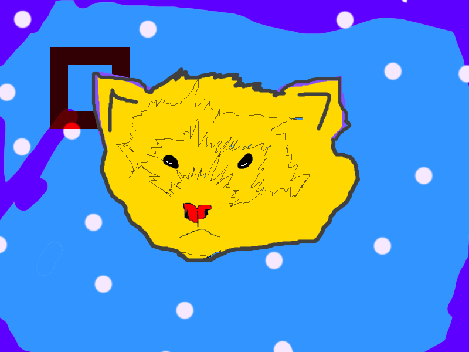

<link rel="stylesheet" href="https://cdn.jsdelivr.net/gh/devicons/devicon@v2.15.1/devicon.min.css">
<strong>just trying to get into this world
 
 
<h2>STATS</h2>

	
	

  <h2>Languages and frameworks</h2>

  
  
  
  

 	
<h2>Things that i've learning</h2>

  
  
  

 

<h2>Work Tools</h2>

 

 
 
	
<h2>Currently doing</h2>
<h3>Zanop message</h3>

Zanop message is basically a messaging web application for mobile and desktop, currently being developed only by myself, but soon it will be an open-source application

  

  
<h2>SOCIAL</h2>
 

